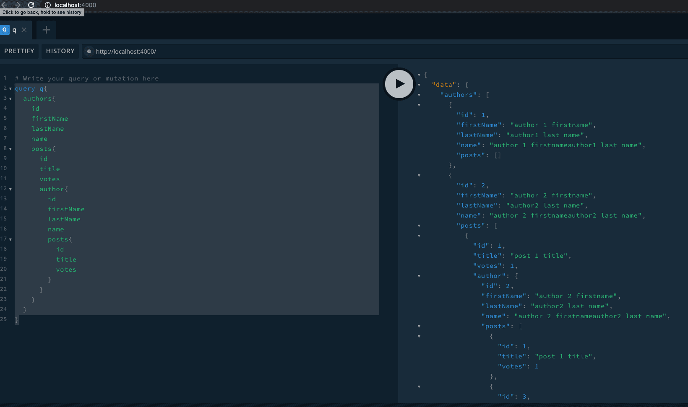

# nested graphql schema with @FieldResolver from `type-graphql`

test query

```
query q{
  authors{
    id
    firstName
    lastName
    name
    posts{
      id
      title
      votes
      author{
        id
        firstName
        lastName
        name
        posts{
          id
          title
          votes
        }
      }
    }
  }
}

```

## run

`yarn`

`yarn start`



references:

https://github.com/MichalLytek/type-graphql/blob/master/docs/resolvers.md
