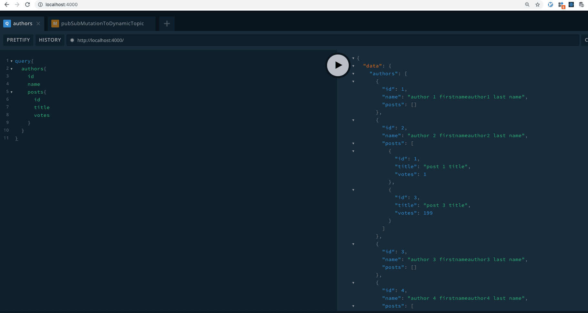

# @FeildResolver `type-graphql`

resolver chain with `type-graphql`

value return from @FieldResolver `posts` in `AuthorResolver` is passed to `PostResolver` `@FieldResolver` includes `id`,`title` and `votes`.

## sample query

```
query{
  authors{
    id
    name
    posts{
      id
      title
      votes
    }
  }
}

```

## console result

```
$ AuthorResolver posts @FieldResolver layer 1
$ AuthorResolver posts @FieldResolver layer 1
$ PostResolver id @FieldResolver id layer 2
$ PostResolver id @FieldResolver title layer 2
$ PostResolver id @FieldResolver votes layer 2
$ PostResolver id @FieldResolver id layer 2
$ PostResolver id @FieldResolver title layer 2
$ PostResolver id @FieldResolver votes layer 2
$ AuthorResolver posts @FieldResolver layer 1
$ AuthorResolver posts @FieldResolver layer 1
$ PostResolver id @FieldResolver id layer 2
$ PostResolver id @FieldResolver title layer 2
$ PostResolver id @FieldResolver votes layer 2
```

## screenshot



## run

`yarn`

`yarn start`

references:

https://github.com/MichalLytek/type-graphql/blob/master/docs/resolvers.md

https://www.apollographql.com/docs/apollo-server/data/resolvers/#resolver-chains
